# zhangzhongfu
怀念张仲甫老师

回忆恩师武汉理工大学张仲甫教授

2026.5.2.

人的一辈子有两种最朴素的纯真的感情让人最难以忘怀，一是父母之爱，一是师生之谊。父母和老师对自己的子女或学生的期许是最纯真且发自内心的，所以尤其感觉珍贵。

1991 年因为高考发挥失利，一直成绩优秀的我没能考上第一志愿上海交通大学而是上了个非重点大学武汉工学院 （后来1995年改为武汉汽车工业大学，2000年合并到武汉理工大学）。当时校名里面都没有大学二字让我很是憋屈。不过上大学的第一天我就暗暗发誓要考研究生，考到理想中的好大学。大学四年，担任班级学习委员，一直成绩优异，为年级数一数二，终于于1995年获得面试研究生资格。以为自己的愿望终于要实现了，还主动联系了华中理工大学（现华中科技大学）的机械学院的史铁林老师。当时年轻的史老师骑着自行车带我在校园里面转了一圈。 结果到正式报送办手续的时候被我们机械系的江征风系主任以回水不流外人田的可耻理由不允许我选择华中科技大学作为硕士接受单位。我气愤不已，恨不得和他同归于尽，差一点上演了荆轲刺秦王的悲剧。4年的等待等到的是继续留校3年。悲愤不已。无奈胳膊硬不过大腿，最后无奈留在了本校。气急之下，我选择了最有权势的张仲甫教授作为硕士导师，他当时是研究生院院长，后来才知道他居然还是江征风的导师。真是冤家路窄。

张老师的办公室在研究生院，见面后就给了我一台康柏电脑，算是计算机条件很好的待遇了，让我得以玩编程学fortran 玩得不亦乐乎。后来我的硕士课题就是做平面包络二次涡轮齿轮的仿真CAD 设计。张老师是湖南汨罗人，和我们岳阳县市邻居，算是半个老乡。记得还有一次一起坐火车回家。张老师最大的一个特点就是没有架子，对学生是特别的随和友好，对他人也是特别的谦虚实在。然而对学术研究确是认认真真、踏踏实实的务实态度。当时记得最深的是张老师有什么外事活动或者访问工厂，经常带着我们出席各种饭局。哈哈，有一次在一个高级饭店，两排美女列队欢迎，搞得我们几个学生都不好意思。张老师还喜欢邀来自己毕业了的研究生一起来吃饭，中间好几次碰到了那个讨厌的江征风。我第一次喝白酒就是在张老师的酒桌上，他说不会喝酒的学生不是他的真学生，我硬着头皮喝了一杯泸州老窖，当时没觉得怎么样，很香，但是过一会儿脑袋就晕晕乎乎了。。从此对白酒敬而远之。 

作为武汉理工大学机电工程学院的教授、博士生导师， 张仲甫老师在汽车悬架系统和机械传动领域拥有深厚的学术造诣和丰富的实践经验。早期主要是带着我们找武汉的制造厂联系生产平面包络二次涡轮齿轮传动机构的事情，我一同参观过好几个加工厂包括青山那边的武汉钢铁公司。后来为了理论联系实际，张老师主要精力转向了汽车悬架系统与汽车钢板弹簧的设计优化，和广西柳州的企业开展的相关合作，同时还参与了广西甘蔗制糖工艺的相关装备研究。作为产学研结合的实践，张老师曾任柳州市政府首席顾问以积极推动技术转化。他曾离开学校创办悬架企业，并为柳州宝铃等企业提供空气悬架技术支持。

恩师张仲甫桃李满天下而快意人生的豪爽性格以及踏实治学、学以致用的学术风格是我一生的楷模。

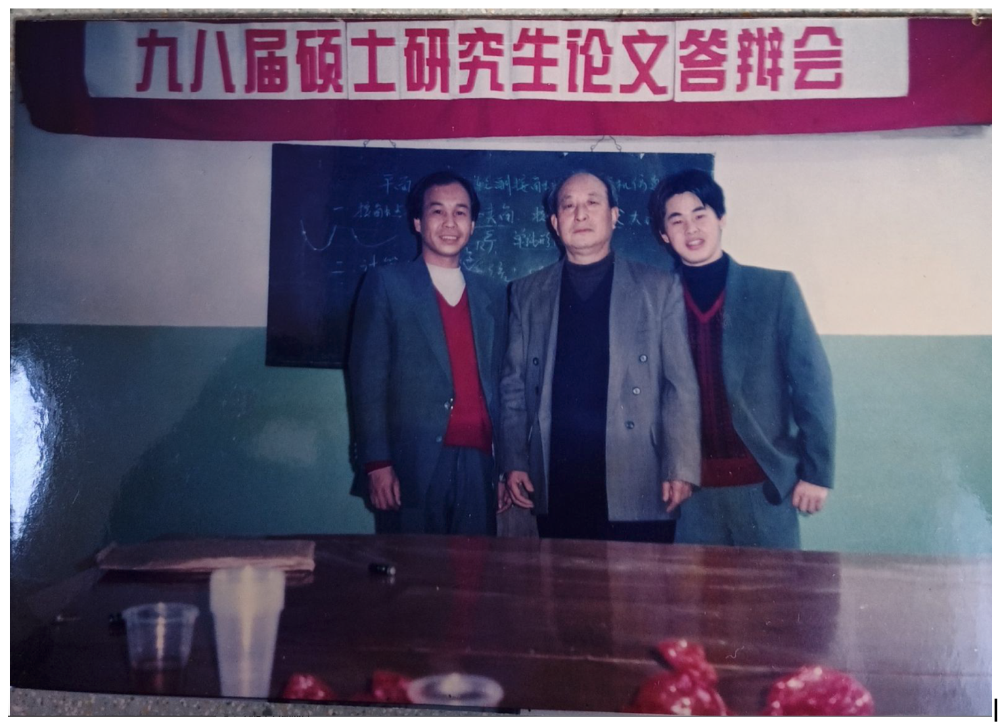

http://lzzx.liuzhou.gov.cn/xqzx/lnq/zxgz_liunan/200805/t20080512_98264.html
相关报道：我市“双百人才工程”结出果实
发布日期：2006-06-20 00:00来源：鹿寨县信息办源：鹿寨县信息办
我市“双百人才工程”引进的专家，武汉理工大学教授、博士生导师、柳州市政府首席顾问张仲甫教授“落户”鹿寨。5月18日，由张仲甫教授提供技术支持的柳州市宝铃乗东空气悬架有限公司，在鹿寨县雒容工业园区正式开业。 宝铃乗东空气悬架有限公司采取强强联合的模式，由香港睡宝集团投资，武汉理工大学教授张仲甫教授提供技术支持，主要产品有汽车悬架元件、电动助力转向系统和无盲区大视野后视镜，产品和技术均可填补广西空白。华中科技大学、武汉理工大学等数家高校在该公司建立科研和教学基地。该公司还与东风汽车公司、北汽福田、江南汽车厂、北京汽车厂等汽车制造公司建立了合作配套关系。 该公司目前投资1200万元，项目总投资1.2亿元，计划2006年完成1亿产值，项目建成后年产值达6亿元，计划三年内完成该项目全部投资。公司首期主要生产汽车钢板弹簧，生产能力为1000吨/月，年产量可满足十余万辆汽车装配。 公司开业当日，国内十余家汽车公司派员前来祝贺，东风汽车公司还组团前来洽谈业务。

中国能制造出一流的汽车悬架吗？ 2008

贺根生

“只要以科学发展观为指导，坚持自主创新，我们中国人就能研发、生产出世界一流的汽车悬架系统！”在第三届中国—东盟博览会汽车展馆，记者见到作为参展商前来洽谈合作业务的柳州市宝铃乘东空气悬架有限公司副董事长、总工张仲甫，当问及我国汽车悬架产业的发展，他显得十分自信。
张仲甫，武汉理工大学教授、博士生导师，今年已68岁。在前来参展的众多汽车参展商中算是年龄最长的一位。他的特殊身份自然引起了记者对他及他经营的悬架企业的兴趣。于是便有了这次特殊的采访。
记者：你为何这么大年纪了还要离开学校出来办企业？
张仲甫：我从上大学到毕业后从事教学、科研工作，一直是与汽车悬架打交道，算起来快50年了。与汽车悬架结下了不解之缘。50年的教学、科研生涯，在为国家培养了一批汽车人才的同时，也积累了开发悬架系统的系统知识和经验。几年前，我就想把自己所掌握的知识更好地服务于民族品牌汽车的发展。虽然担任了柳州市政府和好几家汽车企业的技术顾问，那也只是动动口，做些技术咨询服务工作。五年前，我萌动了走出来办企业，直接从事悬架研发、生产的念头。在香港安睡宝集团的支持下，两年前终于走出学校在广西柳州建起了这家空气悬架公司。经过两年的努力，我们研发的悬架产品已被东风柳汽、长沙北汽福田、上汽通用五菱等多家整车汽车采用。目前，公司主要产品有汽车悬架元件、电动助力转向系统和无盲区大视野后视镜等，产品和技术均填补了广西空白。
记者：过去在大校当教授教书、搞科研，与现在在企业当总工抓技术、搞经营有什么不同？
张仲甫：我的体会是，在大校当教授，为师之道，就要对学生做好传道、授业、解惑，培养他们成为国家有用之才。而在企业当总工，是从技术上保证企业出产品、出好的产品。虽然都是做科技工作，但大学与企业的科技工作却大不相同。其最大的不同之处在企业的科技工作比较实。在学校做科研，在做不下去的时候，舍弃某些限制条件后仍可出成果、发表论文；而企业的研发工作，要求必须解决产品的开发、生产经营的实际问题，其成果要在实际中应用，而且有严格的时间要求。特别是作为整车厂的配套企业，不仅要求产品在技术、质量上要达标，产品供货也要严格按照时间要求，否则就会影响整车厂生产，就会失去信誉。
记者：你认为制约中国民族品牌汽车发展的症结是什么？
张仲甫：主要是思想禁锢、崇洋媚外。中国汽车工业主要经历了三个阶段。第一阶段是三十年一贯制，从1956年，我国在当时苏联老大哥的援助下，生产出第一台解放牌汽车，以后，又搞出了红旗、上海小轿车，但直到1978年改革开放前，这些车型却没有什么变化。第二阶段是直接引进。把国外的汽车品牌引进国内生产，照葫芦画瓢，照着外国人的样板生产，因此前段时间，我们看到中国公路上跑的都是外国品牌的汽车。第三阶段，中国创造。党中央提出坚持科学发展观后，我国汽车工业发展，由中国制造步入了中国创造阶段。打造中国民族品牌的汽车，成为我国汽车工业发展的目标，它需要汽车业包括企业、大学、科研院所的共同努力。
记者：中国汽车工业由不变到变、由“制造”到“创造”，这一变化说明了什么？
张仲甫：说明中国汽车工业已由被动走向理性。我国汽车工业起步比日本、韩国都早。1957年我们就制造出了上海牌轿车，1959年又造出了红旗牌轿车。而日本1960年才搞汽车，韩国更晚，上世纪70年代才起步。可为什么日本、韩国的汽车后来者居上，大大超过了我们，其根本原因在于其发展民族品牌产品意识强。为了推进民族汽车工业的发展，韩国国民包括政府官员都是乘坐本国生产的汽车。
发展民族品牌重在创新，创新是一个民族崛起的灵魂。创新型国家建设战略的确立，为发展我国民族汽车品牌带来了契机。坚持自主创新，创造具有自主知识产权的中国品牌车，是几代中国汽车人的梦想。这也是我在有生之年出来创办汽车企业的主要目的。
记者：你为什么选择空气悬架作为民族品牌汽车创新的起点？
张仲甫：汽车悬架是连接车身和车轮之间一切传力装置的总称。它可以降低汽车在不平路面上行驶时车架与车身的振动,对汽车的行驶平顺性、操纵稳定性和乘坐舒适性有很大影响，是汽车质量、档次的主要标志。随着经济的发展和人们生活水平的提高，消费者对汽车乘坐的舒适性有了更高的要求。
空气悬架作为当今汽车工业的最新技术，越来越受重视。目前国外高级大客车几乎都采用了空气悬架，重型货车使用比例也达到了80%。虽然我国汽车行业亦开始使用空气悬架，但多是从国外引进的产品，由于这些产品是根据外国道路设计、生产的，产品的匹配性不好，而且规模和产品的种类有限。
中国汽车产量2006年将在世界排名第二，明后年可能会达到第一，中国将成为名副其实的汽车大国。汽车大国不等于汽车强国，产量上去了，质量也应跟上。汽车自主创新中悬架的创新是主要关键之一，任务仍十分艰巨，仍需汽车业内人士加倍努力！

附：我的母校武汉理工大学是教育部直属全国重点大学，国家“211工程”和“双一流”建设高校，办学历史可追溯至1898年创办的湖北工艺学堂。2000年5月，原武汉工业大学、武汉交通科技大学和武汉汽车工业大学合并组建武汉理工大学，由此形成了建材建工、交通、汽车三大鲜明行业特色。 其中，武汉汽车工业大学前身为1958年成立的武汉工学院，1995年正式更名为武汉汽车工业大学，是我国汽车工业领域重要的人才培养基地。三校合并后，武汉理工大学在继承百年办学传统的基础上，不断推进学科建设、人才培养和科技创新，逐步发展成为一所以工为主、理工结合、多学科协调发展的高水平大学。

附母校相关图片欣赏

  

    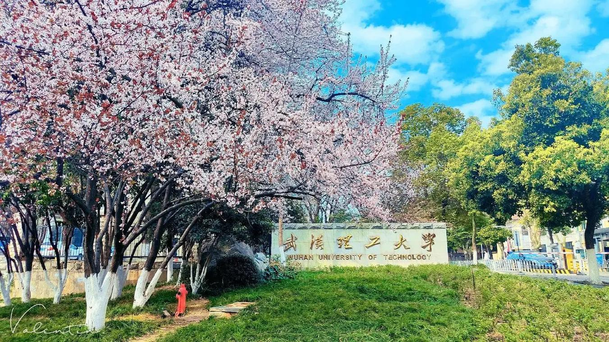
    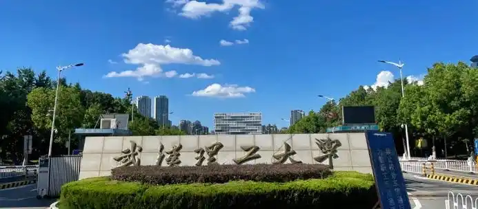
  

  

    
    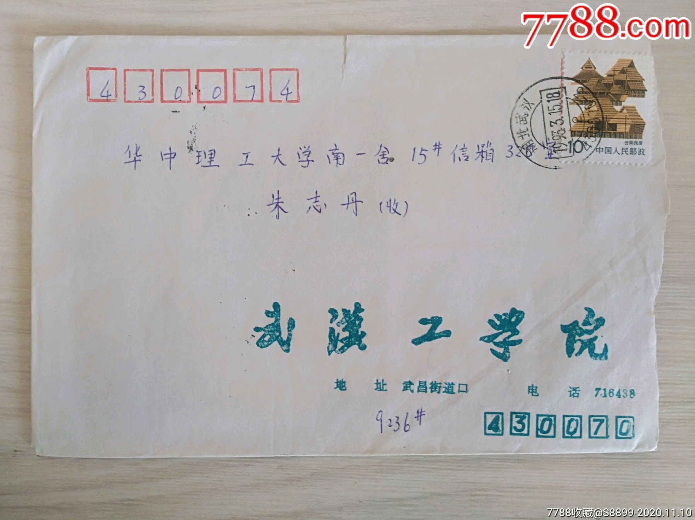
        

  

  

    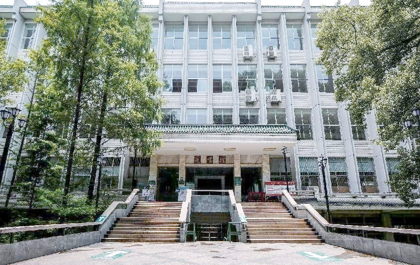
    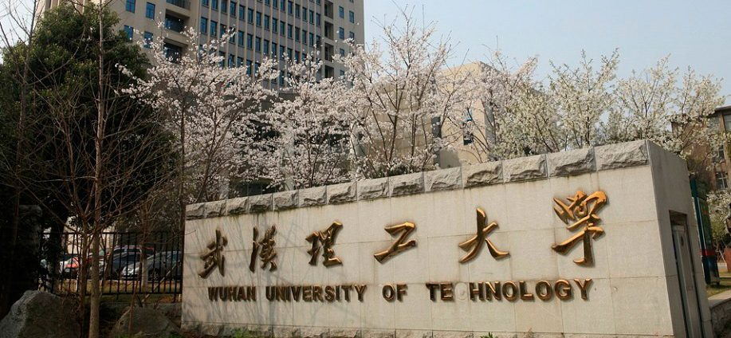
  

  

    
    
  

  

    
    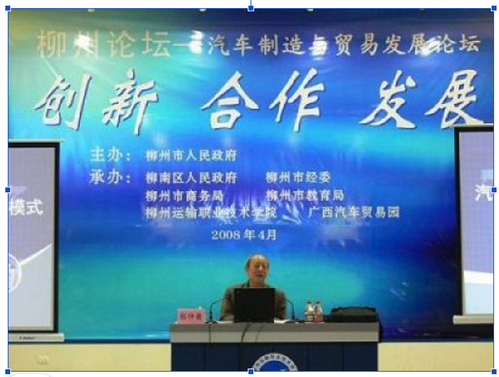
    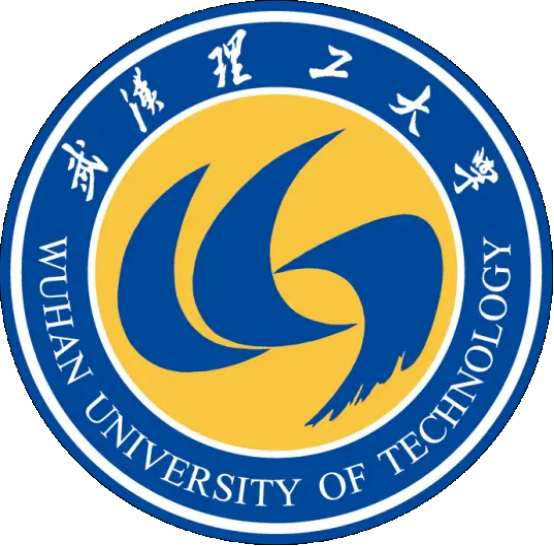    
  

  

    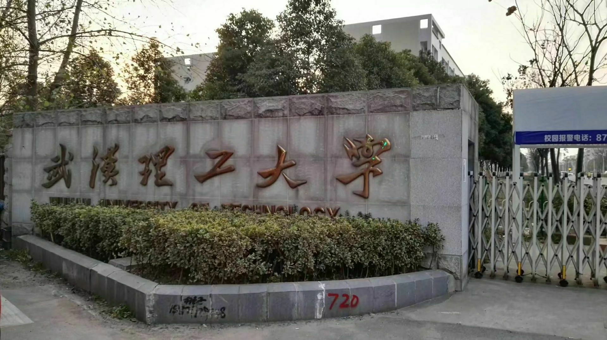
    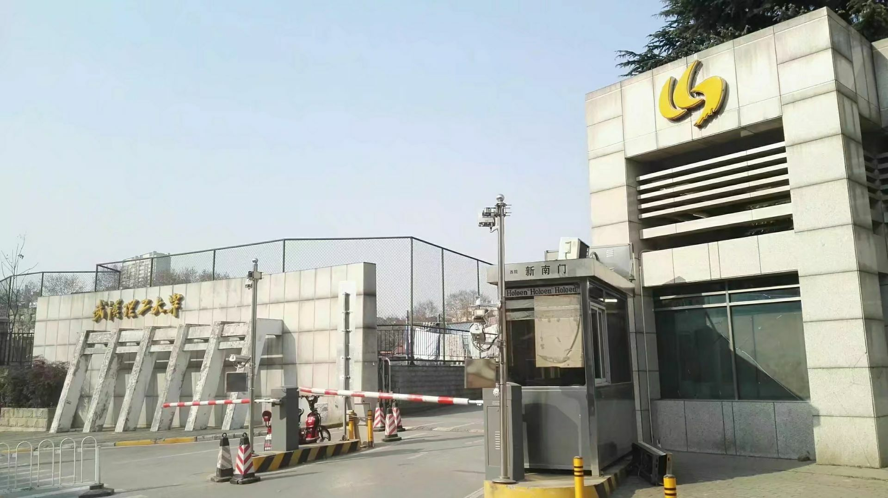
  

    

    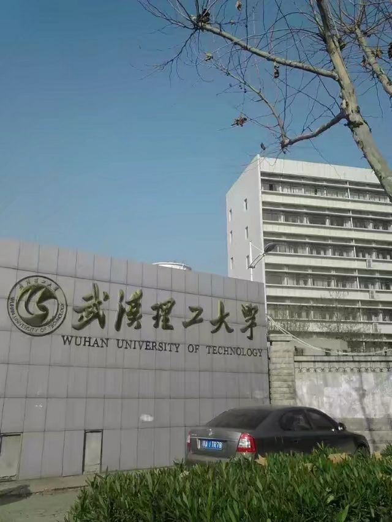
    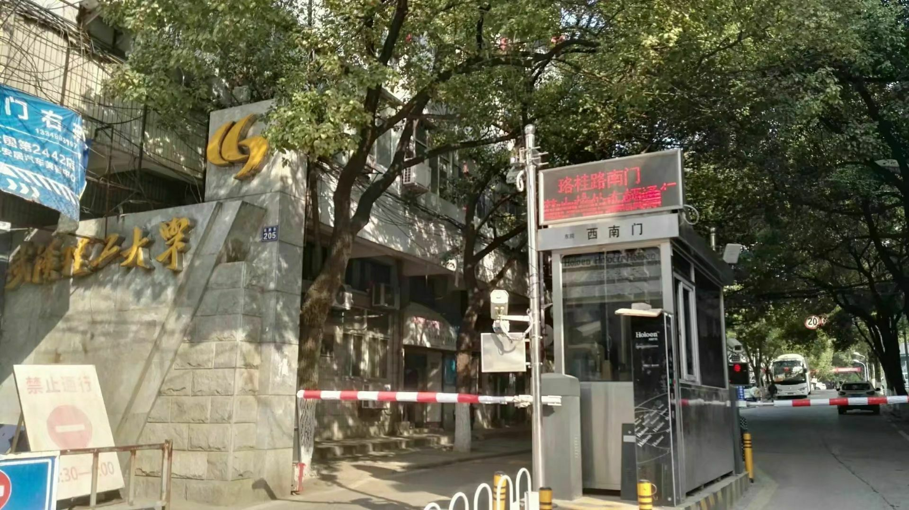
  

    

    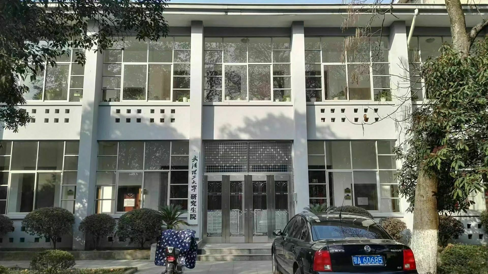
    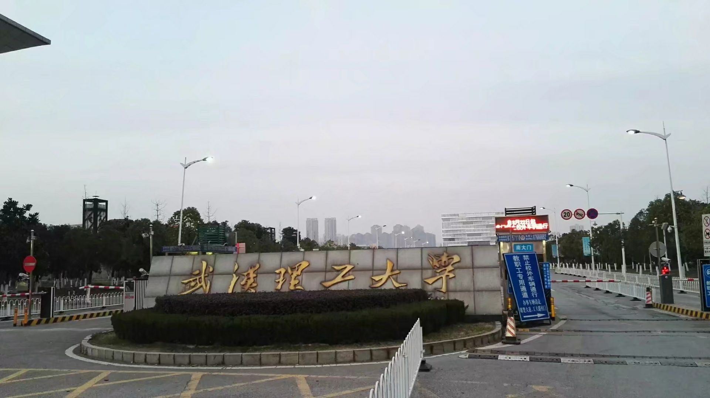
  

    

    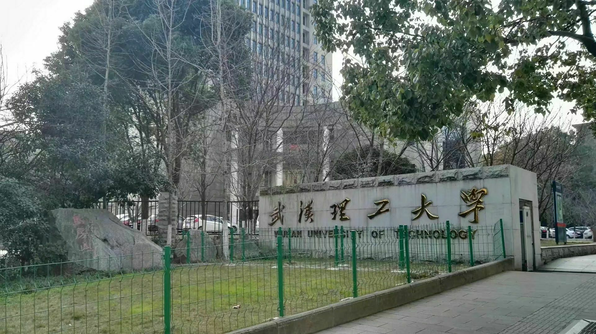
    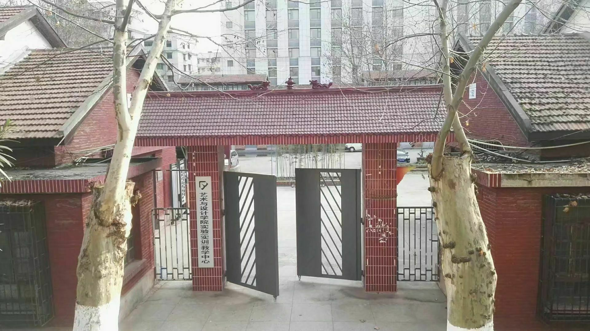
  

    

    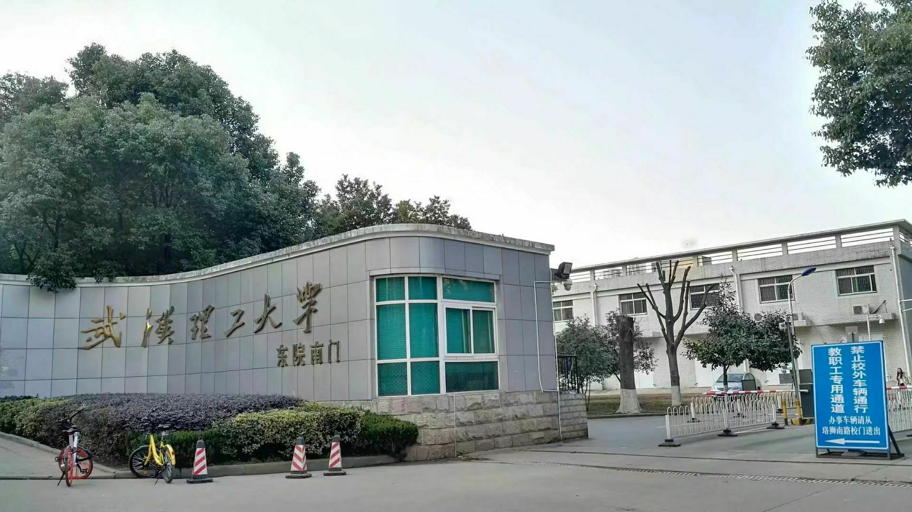
    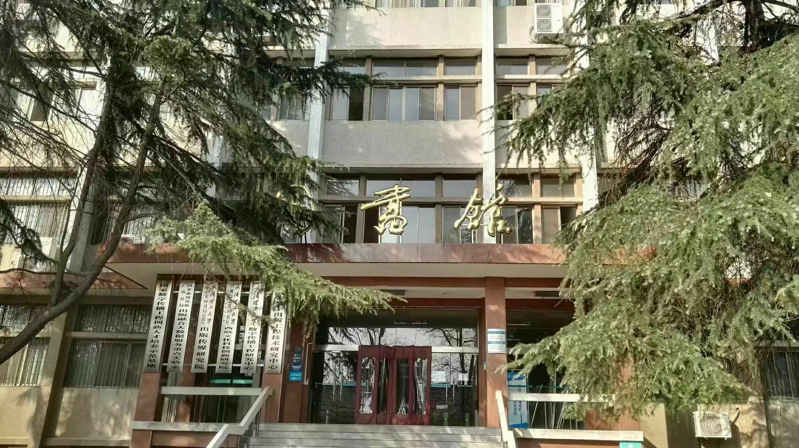
  

    

    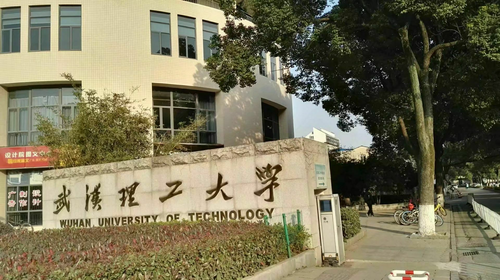
    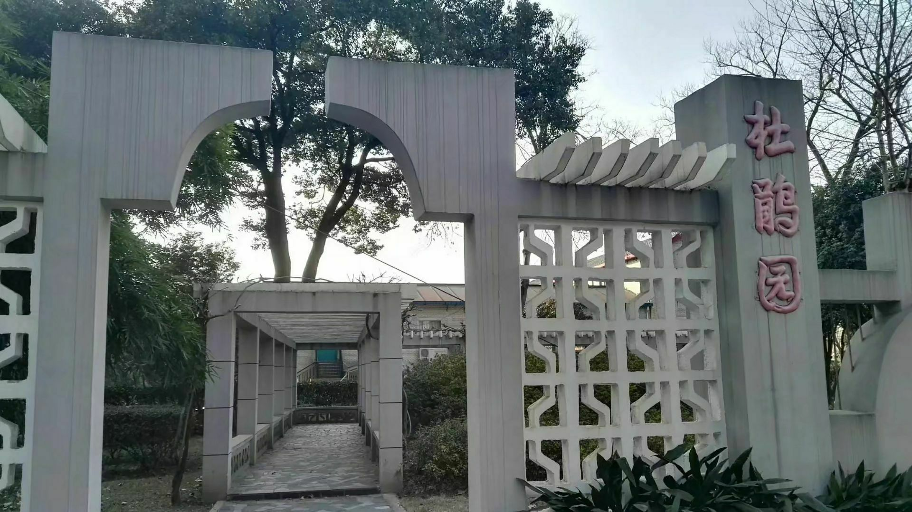
  

  

